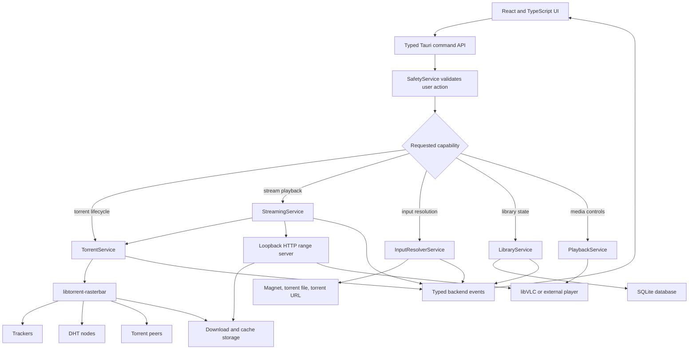
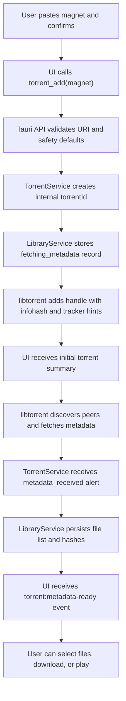
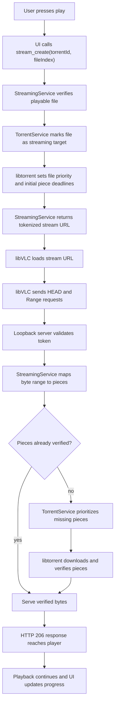
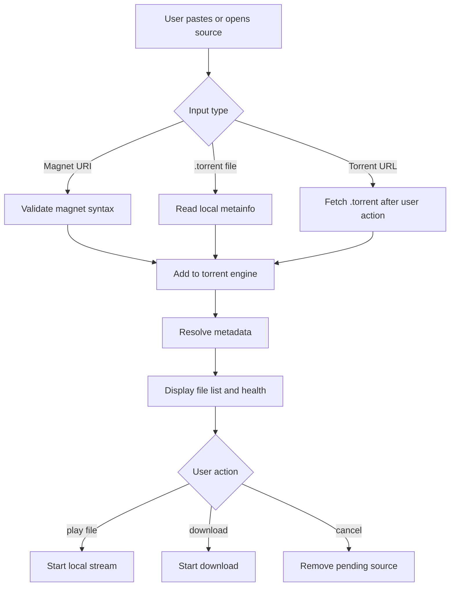

# TorrentDock Engineering Spec

This document turns the knowledge exploration into a concrete implementation plan. It describes what to build, which technology to use, how the pieces communicate, how streaming should work, and what quality bar the app must meet.

The companion technology background is in `techdocs/knowledge-exploration.md`.

## 1. Product Definition

TorrentDock is a cross-platform desktop client for legitimate torrent and magnet workflows.

V1 must support:

- Add magnet links.
- Add `.torrent` files.
- Add direct torrent URLs.
- Fetch metadata for magnets.
- Display torrent file lists.
- Stream playable video/audio before full download completion.
- Download large content such as Linux ISOs, FOSS game builds, public-domain films, and Creative Commons media.
- Manage download queue, cache, seeding policy, and bandwidth limits.

V1 must not:

- Ship a copyrighted movie/game catalog.
- Auto-run downloaded executables.
- Claim anonymity or privacy protection that the app does not provide.

## 2. Technical Decision

### 2.1 Chosen Stack

Use:

- **Tauri 2** for the desktop app shell.
- **React + TypeScript** for UI.
- **Rust** for backend orchestration.
- **libtorrent-rasterbar** for torrent protocol handling.
- **libVLC** for playback.
- **SQLite** for local persistent state.

### 2.2 Rationale

Tauri 2:

- Smaller footprint than Electron.
- Strong Rust backend integration.
- Security model with explicit commands, permissions, and capabilities.
- Works across Windows, macOS, and Linux.

React + TypeScript:

- Good fit for complex desktop UI state.
- Strong component ecosystem.
- Clean shared domain types for frontend/backend command contracts.

Rust:

- Good for long-running local services.
- Strong error handling and concurrency model.
- Natural Tauri backend language.

libtorrent-rasterbar:

- Mature BitTorrent engine.
- Handles trackers, DHT, peer exchange, metadata exchange, piece selection, file priorities, piece deadlines, rate limits, resume data, and alerts.
- Avoids hand-rolling a security-sensitive P2P protocol.

libVLC:

- Broad media/container support.
- Supports network streams and local HTTP range playback.
- External player fallback remains easy.

SQLite:

- Local and portable.
- No server dependency.
- Sufficient for library, settings, providers, history, and playback state.

### 2.3 Alternatives

**Electron + WebTorrent**

Use only if rapid prototype speed becomes more important than app size and native control. It is attractive for proof-of-concept playback but less ideal for a polished desktop app with Rust-native services.

**Flutter desktop**

Viable for UI, but native torrent engine and embedded player integration likely add more glue work.

**rqbit / librqbit**

Evaluate as a future Rust-native engine path. Do not choose as default until streaming controls, DHT, metadata exchange, resume data, and production behavior are validated.

## 3. Architecture Overview

```text
React UI
  |
  | Tauri commands and events
  v
Rust App Backend
  |
  | owns services
  v
TorrentService  InputResolverService  LibraryService  PlaybackService  SafetyService
  |
  | engine adapter
  v
libtorrent-rasterbar
  |
  | verified pieces
  v
Local Storage + Local HTTP Range Stream Server
  |
  | http://127.0.0.1:<port>/stream/...
  v
libVLC or external player
```

Core rule: the frontend never talks directly to libtorrent, the filesystem, or the stream server internals. It talks through typed Tauri commands and receives typed events.

### 3.1 Component Architecture Diagram



## 4. Services

### 4.1 TorrentService

Owns the torrent engine session.

Responsibilities:

- Initialize libtorrent session.
- Restore session state and resume data at startup.
- Add torrents from magnet URI, `.torrent` path, or torrent URL.
- Track torrent handles by internal `torrentId`.
- Fetch magnet metadata.
- Emit metadata-ready events.
- Apply file priorities after metadata is available.
- Apply piece priorities and deadlines for streaming.
- Pause, resume, remove, and recheck torrents.
- Save resume data on interval and shutdown.
- Apply global and per-torrent rate limits.
- Apply seeding policy.
- Expose torrent summaries to UI.

Implementation notes:

- Use a stable internal UUID for `torrentId`.
- Store v1 and v2 hashes separately when available.
- Store the libtorrent handle only in memory.
- Persist resume data as engine-native bytes.
- Process libtorrent alerts on a dedicated backend task.
- Debounce high-frequency progress events before sending to UI.

### 4.2 StreamingService

Runs a local HTTP server for playback.

Responsibilities:

- Bind to `127.0.0.1` by default.
- Allocate a random free port.
- Generate short-lived stream tokens.
- Serve `HEAD` and `GET`.
- Support HTTP range requests.
- Translate byte ranges to file offsets and torrent pieces.
- Tell TorrentService to prioritize required pieces.
- Wait for verified bytes when needed.
- Return correct HTTP status and headers.
- Emit buffering events.

Required HTTP behavior:

- `200 OK` only for full-content requests when safe.
- `206 Partial Content` for range requests.
- `416 Range Not Satisfiable` for invalid ranges.
- `401 Unauthorized` for missing/expired token.
- `404 Not Found` for unknown torrent/file.
- `503 Service Unavailable` when the torrent is unavailable or engine is stopped.

Token behavior:

- Token is scoped to one `torrentId` and `fileIndex`.
- Token expires after a short TTL, such as 30 minutes.
- Playback can refresh token through a backend command.
- Token is never logged in full.

### 4.3 PlaybackService

Coordinates media playback.

Responsibilities:

- Embed libVLC if platform packaging allows.
- Load stream URL into player.
- Expose play, pause, seek, volume, subtitles, fullscreen, and playback rate.
- Track playback position.
- Store resume position in LibraryService.
- Provide external-player fallback.

Best practice:

- Keep playback UI independent from torrent state.
- Show buffering as playback state plus torrent cause.
- Allow "download only" for files that are not stream-friendly.

### 4.4 InputResolverService

Manages user-supplied torrent inputs and normalizes them before they reach the torrent engine.

Responsibilities:

- Accept magnet URI text.
- Accept local `.torrent` files.
- Accept direct `.torrent` URLs.
- Validate input shape.
- Normalize source metadata.
- Fetch remote `.torrent` files when the user provides a direct URL.
- Hand validated inputs to TorrentService.
- Keep input errors visible and recoverable.

V1 input types:

- Manual magnet input.
- Local `.torrent` file.
- Direct `.torrent` URL.

### 4.5 LibraryService

Persists local state.

Responsibilities:

- Store torrent records.
- Store file records.
- Store provider records.
- Store playback progress.
- Store user labels and categories.
- Store cache and download paths.
- Store warnings acknowledged by user.
- Store resume data references.

Recommended database:

- SQLite with migrations.
- One database per user profile.
- Do not store stream tokens.
- Do not store secrets unencrypted.

### 4.6 SafetyService

Centralizes user-protection rules.

Responsibilities:

- First-run legal-use notice.
- IP exposure warning.
- Seeding policy explanation.
- Executable/archive opening warning.
- Provider terms warning.
- Auto-download confirmation.
- Local server binding checks.

SafetyService should provide reusable decisions to UI and backend, not just text.

Example decisions:

```ts
canAutoDownload(providerId, ruleId): SafetyDecision
canOpenFile(torrentId, fileIndex): SafetyDecision
canEnableRemoteControl(): SafetyDecision
```

## 5. Data Model

### 5.1 Torrent Table

```text
torrents
  id text primary key
  name text not null
  info_hash_v1 text null
  info_hash_v2 text null
  source_type text not null
  source_uri text null
  status text not null
  save_path text not null
  added_at integer not null
  completed_at integer null
  last_seen_at integer not null
  pinned integer not null default 0
  user_label text null
  error_message text null
```

### 5.2 Torrent Files Table

```text
torrent_files
  torrent_id text not null
  file_index integer not null
  path text not null
  size integer not null
  media_kind text not null
  priority text not null
  progress real not null default 0
  primary key (torrent_id, file_index)
```

### 5.3 Resume Data Table

```text
resume_data
  torrent_id text primary key
  engine text not null
  data blob not null
  saved_at integer not null
```

### 5.4 Providers Table

```text
providers
  id text primary key
  type text not null
  name text not null
  base_url text null
  config_json text not null
  enabled integer not null default 1
  created_at integer not null
  last_refresh_at integer null
```

### 5.5 Provider Results Table

```text
provider_results
  id text primary key
  provider_id text not null
  title text not null
  source_url text not null
  magnet_uri text null
  torrent_url text null
  info_hash_v1 text null
  info_hash_v2 text null
  size integer null
  seeders integer null
  leechers integer null
  category text null
  license_hint text null
  first_seen_at integer not null
  last_seen_at integer not null
```

### 5.6 Playback State Table

```text
playback_state
  torrent_id text not null
  file_index integer not null
  position_ms integer not null
  duration_ms integer null
  updated_at integer not null
  primary key (torrent_id, file_index)
```

## 6. Frontend Domain Types

```ts
export type TorrentInput =
  | { type: "magnet"; uri: string }
  | { type: "torrentFile"; path: string }
  | { type: "url"; url: string };

export type TorrentStatus =
  | "fetching_metadata"
  | "queued"
  | "downloading"
  | "streaming"
  | "paused"
  | "seeding"
  | "completed"
  | "checking"
  | "error";

export type TorrentSummary = {
  id: string;
  infoHashV1?: string;
  infoHashV2?: string;
  name: string;
  status: TorrentStatus;
  progress: number;
  downloadRate: number;
  uploadRate: number;
  peers: number;
  seeds?: number;
  selectedFileCount: number;
  totalFileCount: number;
  totalSize: number;
  downloadedBytes: number;
  uploadedBytes: number;
  errorMessage?: string;
};

export type TorrentFile = {
  torrentId: string;
  index: number;
  path: string;
  size: number;
  progress: number;
  priority: "skip" | "low" | "normal" | "high" | "stream";
  mediaKind: "video" | "audio" | "subtitle" | "archive" | "executable" | "disk_image" | "unknown";
};

export type StreamDescriptor = {
  torrentId: string;
  fileIndex: number;
  url: string;
  expiresAt: string;
  mimeType?: string;
};

export type ProviderResult = {
  id: string;
  providerId: string;
  title: string;
  sourceUrl: string;
  magnetUri?: string;
  torrentUrl?: string;
  infoHashV1?: string;
  infoHashV2?: string;
  size?: number;
  seeders?: number;
  leechers?: number;
  category?: string;
  licenseHint?: string;
};

export type SeedPolicy = {
  enabledAfterDownload: boolean;
  ratioLimit?: number;
  timeLimitMinutes?: number;
};

export type BandwidthLimits = {
  downloadBytesPerSecond?: number;
  uploadBytesPerSecond?: number;
};
```

## 7. Tauri Commands

Commands should be explicit and narrow. Avoid catch-all commands.

### 7.1 Torrent Commands

```ts
torrent_add(input: TorrentInput, options?: AddTorrentOptions): Promise<TorrentSummary>
torrent_pause(id: string): Promise<void>
torrent_resume(id: string): Promise<void>
torrent_remove(id: string, deleteData: boolean): Promise<void>
torrent_recheck(id: string): Promise<void>
torrent_get(id: string): Promise<TorrentSummary>
torrent_list(): Promise<TorrentSummary[]>
torrent_files(id: string): Promise<TorrentFile[]>
torrent_select_files(id: string, priorities: FilePriorityUpdate[]): Promise<void>
torrent_set_limits(id: string, limits: BandwidthLimits): Promise<void>
torrent_set_seed_policy(id: string, policy: SeedPolicy): Promise<void>
```

### 7.2 Streaming Commands

```ts
stream_create(id: string, fileIndex: number): Promise<StreamDescriptor>
stream_refresh_token(id: string, fileIndex: number): Promise<StreamDescriptor>
stream_stop(id: string, fileIndex: number): Promise<void>
```

### 7.3 Provider Commands

```ts
provider_create(input: ProviderCreateInput): Promise<ProviderSummary>
provider_update(id: string, input: ProviderUpdateInput): Promise<ProviderSummary>
provider_delete(id: string): Promise<void>
provider_list(): Promise<ProviderSummary[]>
provider_search(id: string, query: string, filters?: ProviderFilters): Promise<ProviderResult[]>
provider_refresh(id: string): Promise<ProviderResult[]>
```

### 7.4 Library Commands

```ts
library_list(): Promise<LibraryItem[]>
library_update_metadata(id: string, metadata: LibraryMetadataUpdate): Promise<void>
library_forget(id: string): Promise<void>
library_reveal_file(id: string, fileIndex: number): Promise<void>
library_open_file(id: string, fileIndex: number): Promise<SafetyDecision>
```

### 7.5 Settings Commands

```ts
settings_get(): Promise<AppSettings>
settings_update(update: AppSettingsUpdate): Promise<AppSettings>
settings_choose_download_dir(): Promise<string>
settings_choose_cache_dir(): Promise<string>
```

## 8. Backend Events

Events should be typed and throttled.

```ts
torrent:summary-updated
torrent:metadata-ready
torrent:file-progress
torrent:error
stream:buffering
stream:ready
stream:error
provider:refresh-started
provider:refresh-finished
provider:error
library:changed
settings:changed
```

Rules:

- Progress events should be throttled to avoid UI overload.
- Critical state changes should be sent immediately.
- Errors should include stable error codes plus human-readable messages.
- Backend logs should include correlation IDs, not stream tokens.

## 9. Key Flows

### 9.1 Add Magnet

```text
User submits magnet
  -> UI calls torrent_add
  -> backend validates URI
  -> TorrentService creates internal torrentId
  -> libtorrent adds handle with infohash and tracker hints
  -> LibraryService stores source and fetching_metadata state
  -> UI shows metadata-fetching card
  -> alerts report metadata received
  -> TorrentService stores file list
  -> UI enables file selection, download, and play
```



Failure handling:

- Invalid magnet: reject immediately.
- No peers: stay in fetching state with clear reason.
- Metadata timeout: show retry and edit tracker options.
- Duplicate infohash: offer to focus existing torrent.

### 9.2 Add `.torrent`

```text
User chooses file
  -> UI calls torrent_add
  -> backend parses torrent metadata
  -> computes/stores hashes
  -> shows file list immediately
  -> user selects files and destination
  -> download starts
```

Failure handling:

- Invalid bencoding: show parse error.
- Unsupported torrent version: show unsupported message.
- Path permission error: ask user to choose another destination.

### 9.3 Stream File

```text
User presses play
  -> UI calls stream_create
  -> StreamingService verifies file exists and is playable
  -> TorrentService sets file priority to stream
  -> StreamingService generates stream URL
  -> PlaybackService loads URL into libVLC
  -> player sends HEAD/Range requests
  -> StreamingService maps byte ranges to pieces
  -> TorrentService sets deadlines for missing pieces
  -> verified bytes are served
```



Failure handling:

- Metadata not ready: show fetching metadata.
- File skipped: raise priority and start download.
- No peers: show waiting for peers.
- Token expired: refresh and retry.
- Unsupported codec: offer external player or download.

### 9.4 Manual Source Resolution

```text
User supplies magnet, torrent file, or torrent URL
  -> InputResolverService validates input
  -> remote torrent URL is fetched only after explicit user action
  -> TorrentService adds source to engine
  -> metadata and file list are resolved
  -> UI lets user choose playable/downloadable files
  -> playback or download starts through rqbit
```



Failure handling:

- Invalid input: show validation error.
- Remote torrent URL unavailable: show fetch error.
- Metadata unavailable: show peer discovery and retry state.
- Rate limited: show retry time.
- No magnet/torrent URL: result is informational only.
- Ambiguous duplicates: group results under one item.

## 10. Streaming Algorithm

### 10.1 File-To-Piece Mapping

For a selected file:

```text
file_start_offset = sum(size of previous files in torrent)
file_end_offset = file_start_offset + file_size - 1
first_piece = floor(file_start_offset / piece_length)
last_piece = floor(file_end_offset / piece_length)
```

For an HTTP byte range inside the file:

```text
absolute_start = file_start_offset + range_start
absolute_end = file_start_offset + range_end
needed_first_piece = floor(absolute_start / piece_length)
needed_last_piece = floor(absolute_end / piece_length)
```

Do not implement custom storage reads if libtorrent provides safe read APIs. This mapping is for priority decisions and diagnostics.

### 10.2 Priority Windows

When playback starts:

- Set selected media file priority to `stream`.
- Set subtitle files to `high` if selected.
- Set unrelated files to `skip` or `low` based on user choice.
- Prioritize beginning pieces.
- Prioritize current range pieces.
- Prioritize read-ahead window.
- Optionally prioritize tail pieces for MP4 probing.

When playback seeks:

- Clear stale deadlines outside useful windows.
- Set immediate deadlines for seek target.
- Keep a smaller backward buffer.
- Rebuild read-ahead window from the new playhead.

### 10.3 Deadline Use

With libtorrent, use piece deadlines for urgent streaming pieces. `set_piece_deadline` tells the engine a piece is time-critical. This is better than setting every piece to sequential mode because the engine can use peer speed estimates and request queues.

Use priorities for broad selection:

- File priority: user intent.
- Piece priority: near-term importance.
- Piece deadline: playback urgency.

Avoid mixing file and piece priorities carelessly. Changing file priority can reset piece priorities in libtorrent, so StreamingService should own the streaming priority policy.

### 10.4 Buffer State

Expose buffering states:

```text
ready
buffering_missing_pieces
buffering_no_peers
buffering_slow_peers
buffering_checking
error
```

UI should show:

- Download rate.
- Connected peers.
- Buffer health.
- Playback position.
- Whether the app is waiting for metadata, peers, or verified bytes.

## 11. Security Model

### 11.1 Tauri Command Security

Use Tauri capabilities and permissions to expose only required commands to the main window.

Rules:

- No arbitrary shell command access from UI.
- No arbitrary filesystem delete from UI.
- File picking must use native dialogs.
- Backend validates all paths.
- Backend normalizes provider URLs.
- Backend rejects non-loopback stream bind address unless an advanced setting enables remote access.

### 11.2 Local Server Security

Rules:

- Bind to `127.0.0.1`.
- Use random port.
- Require short-lived tokens.
- Scope token to stream.
- Do not expose directory listings.
- Do not serve arbitrary files.
- Do not log full URLs with tokens.
- Add CORS restrictions if browser playback is used.

### 11.3 Input Security

Rules:

- Validate magnet and URL input before sending it to the engine.
- Fetch remote torrent URLs only after explicit user action.
- Do not evaluate arbitrary scripts or provider code.
- Do not log full URLs if they contain credentials or private tokens.

## 12. Error Model

Backend errors should include:

```ts
type AppError = {
  code: string;
  message: string;
  recoverable: boolean;
  details?: Record<string, unknown>;
};
```

Recommended error codes:

```text
TORRENT_INVALID_MAGNET
TORRENT_INVALID_FILE
TORRENT_DUPLICATE
TORRENT_METADATA_TIMEOUT
TORRENT_NO_PEERS
TORRENT_ENGINE_ERROR
STREAM_TOKEN_EXPIRED
STREAM_FILE_NOT_READY
STREAM_RANGE_INVALID
STREAM_UNSUPPORTED_MEDIA
PROVIDER_INVALID_CONFIG
PROVIDER_RATE_LIMITED
PROVIDER_UNAVAILABLE
FILESYSTEM_PERMISSION_DENIED
SAFETY_CONFIRMATION_REQUIRED
```

## 13. UI Requirements

### 13.1 Main Views

- Library
- Downloads
- Player
- Search
- Providers
- Settings
- Diagnostics

### 13.2 Library View

Show:

- Title/name.
- Status.
- Progress.
- Download/upload speed.
- Peer count.
- File count.
- Size.
- Source/provider.
- Actions: play, pause, resume, remove, reveal, details.

### 13.3 Player View

Show:

- Video player.
- Playback controls.
- Buffer state.
- Torrent health compact status.
- File selector for multi-file torrents.
- Subtitle selector.
- External player button.

### 13.4 Provider View

Show:

- Provider list.
- Provider type.
- Enabled status.
- Last refresh.
- Last error.
- Rate-limit status if known.
- Add/edit/delete controls.

### 13.5 Diagnostics View

Show:

- Engine version.
- DHT status.
- Session stats.
- Active torrents.
- Tracker status.
- Recent errors.
- Export diagnostics button.

Do not include stream tokens, provider credentials, or full sensitive paths in diagnostics export without user confirmation.

## 14. Implementation Phases

### Phase 1: Foundation

Build:

- Tauri 2 app scaffold.
- React app shell and navigation.
- SQLite migration system.
- Settings storage.
- TorrentService interface.
- libtorrent integration spike.
- Manual magnet add.
- Manual `.torrent` add.
- Metadata-ready event.
- File list display.
- Pause/resume/remove.
- Basic download progress.

Exit criteria:

- User can add a legal torrent, fetch metadata, select files, download, pause, resume, remove, and restart the app without losing state.

### Phase 2: Streaming MVP

Build:

- StreamingService local HTTP server.
- Tokenized stream URL.
- HTTP `HEAD` and `Range` support.
- Piece priority/deadline scheduler.
- libVLC playback integration.
- External player fallback.
- Buffering state events.
- Playback position persistence.

Exit criteria:

- User can stream a legal MP4/MKV torrent before full download, seek during playback, and recover from app restart.

### Phase 3: Download Manager

Build:

- Queue management.
- Destination picker.
- Per-torrent file priorities.
- Bandwidth limits.
- Seed ratio/time policy.
- Completed item actions.
- Executable/archive warnings.
- Cache size management.

Exit criteria:

- User can manage multiple downloads and streaming sessions with predictable disk, queue, and seeding behavior.

### Phase 4: Input And Library Polish

Build:

- Drag-and-drop torrent input.
- Recent source history.
- Duplicate torrent detection.
- Better metadata retry controls.
- Library filters and labels.
- Bulk pause/resume/remove actions.
- Download location rules.
- Import/export diagnostics for torrent state.

Exit criteria:

- User can manage explicit torrent inputs and library state without needing hidden automation.

### Phase 5: Production Hardening

Build:

- Signed installers.
- Auto-update.
- Crash reporting.
- Diagnostics export.
- Accessibility pass.
- Privacy review.
- Legal review.
- Platform-specific QA.

Exit criteria:

- App can be distributed as a legitimate desktop torrent client with documented limitations and safety controls.

## 15. Testing Strategy

### 15.1 Test Content

Use only authorized content:

- Linux ISOs.
- Public-domain films.
- Creative Commons media.
- Open-source game builds.
- Internal generated torrent fixtures.

### 15.2 Unit Tests

Cover:

- Magnet parsing.
- Provider result normalization.
- Deduplication.
- File media-kind detection.
- Range parsing.
- Token generation and expiration.
- Safety decision rules.
- Database migrations.

### 15.3 Integration Tests

Cover:

- Add `.torrent`.
- Add magnet and fetch metadata.
- Add direct `.torrent` URL.
- Pause/resume.
- Save and restore resume data.
- Local stream server range responses.
- Expired token rejection.

### 15.4 Streaming Tests

Cover:

- MP4 startup.
- MKV startup.
- Seek forward.
- Seek backward.
- Slow peer simulation.
- No peer state.
- Metadata timeout.
- Cache eviction.
- External player fallback.

### 15.5 Platform Tests

Windows:

- Installer.
- Firewall prompt.
- Magnet link registration.
- Long paths and spaces.
- VLC packaging.

macOS:

- Code signing.
- Notarization.
- App bundle paths.
- Magnet link registration.
- VLC packaging.

Linux:

- AppImage/deb/rpm path.
- System webview dependencies.
- Codec behavior.
- Desktop file magnet registration.

## 16. Observability

### 16.1 Logs

Log:

- App startup/shutdown.
- Engine startup/shutdown.
- Torrent add/remove.
- Metadata received.
- Provider refresh start/end.
- Stream start/end.
- Errors with stable codes.

Do not log:

- Stream tokens.
- Provider credentials.
- Full magnet links by default.
- Sensitive local paths unless diagnostics export includes explicit user consent.

### 16.2 Metrics

Local-only diagnostic metrics:

- Active torrents.
- Download/upload rate.
- Peer counts.
- DHT node count.
- Tracker errors.
- Buffering duration.
- Stream range latency.
- Cache usage.

## 17. Packaging And Distribution

V1 distribution:

- Direct desktop downloads first.
- Windows installer.
- macOS signed and notarized app.
- Linux AppImage or deb/rpm.

Avoid app stores at first because torrent and provider functionality can trigger review concerns, especially around third-party content and copyright.

Packaging tasks:

- Bundle or locate libVLC.
- Bundle libtorrent dependencies.
- Sign sidecars if sidecar architecture is used.
- Register magnet protocol handler.
- Include privacy policy and legal-use notice.

## 18. Open Technical Risks

### 18.1 libtorrent Packaging

C++ library packaging across Windows, macOS, and Linux may be the hardest build problem.

Mitigation:

- Create a packaging spike before UI-heavy work.
- Consider sidecar process if linking becomes brittle.
- Keep engine adapter abstract.

### 18.2 libVLC Embedding

Embedding behavior and codec availability differ by platform.

Mitigation:

- Build external player fallback early.
- Keep playback adapter abstract.
- Verify packaging early.

### 18.3 Streaming Edge Cases

Some torrents are not stream-friendly due to low peers, large pieces, archive formats, or media metadata layout.

Mitigation:

- Set honest UI expectations.
- Support download-first mode.
- Add media probing later.

### 18.4 Remote URL Handling

Direct torrent URLs can fail, redirect, or point at unexpected content.

Mitigation:

- Limit automatic redirects.
- Validate response content type and size.
- Show source URL in the UI.
- Store the original user-provided source string for traceability.

## 19. Engineering Defaults

- Desktop V1 only.
- Tauri 2 + React + TypeScript + Rust.
- libtorrent first.
- libVLC first, external player fallback.
- SQLite local database.
- Local stream server on loopback.
- Tokenized stream URLs.
- Engine-native resume data.
- DHT enabled by default with user setting.
- Post-completion seeding conservative by default.
- V1 accepts explicit user-provided inputs only.
- Downloads start only from explicit user action.

## 20. Source Links

- [Tauri permissions](https://v2.tauri.app/security/permissions/)
- [Tauri runtime authority](https://v2.tauri.app/security/runtime-authority/)
- [Tauri sidecar guide](https://v2.tauri.app/learn/sidecar-nodejs/)
- [libtorrent manual](https://libtorrent.org/manual-ref.html)
- [libtorrent torrent handle reference](https://libtorrent.org/reference-Torrent_Handle.html)
- [libtorrent streaming implementation](https://www.libtorrent.org/streaming.html)
- [libtorrent resume data reference](https://www.libtorrent.org/reference-Resume_Data.html)
- [libVLC documentation](https://videolan.videolan.me/vlc/libvlc.html)
- [WebTorrent docs](https://webtorrent.io/docs)
- [librqbit docs](https://docs.rs/librqbit/latest/librqbit/)
- [Apple App Review Guidelines](https://developer.apple.com/app-store/review/guidelines/)
