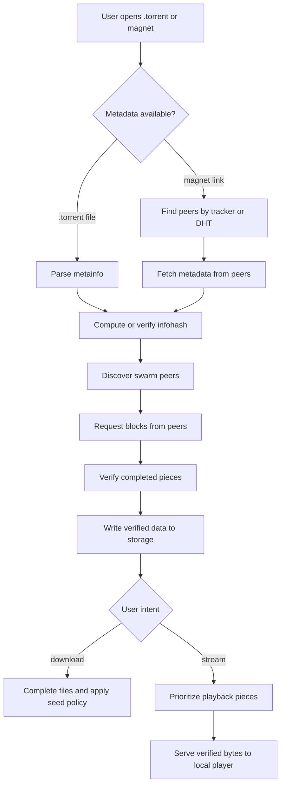
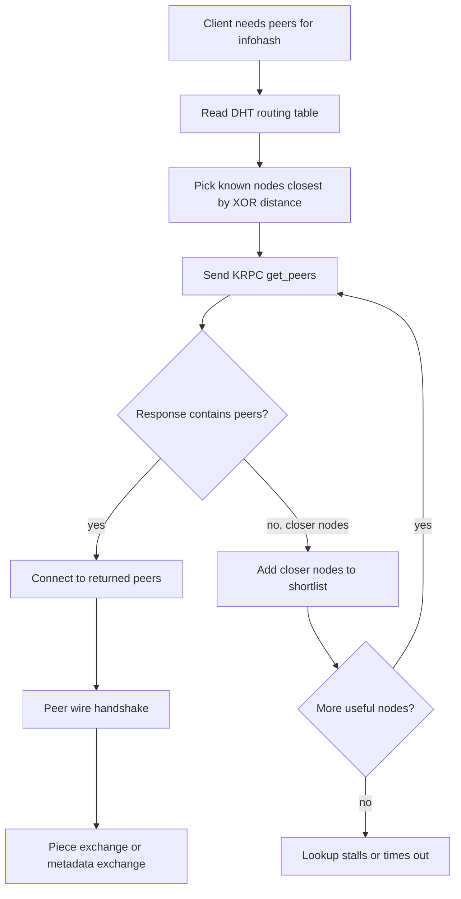
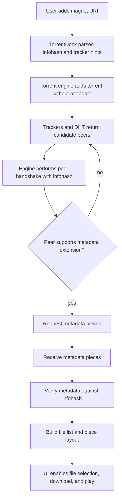
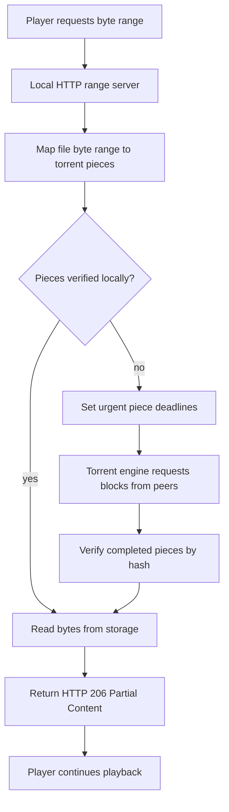

# TorrentDock Knowledge Exploration

This document explains the technology behind TorrentDock before any product or implementation decisions. It focuses on how BitTorrent, magnet links, metadata exchange, peer discovery, streaming, direct torrent inputs, and torrent-client safety actually work.

TorrentDock should be a torrent client and media/download workflow tool that makes the mechanics visible enough for users to understand what the app is doing. Torrent technology is content-neutral. The same mechanics can distribute Linux ISOs, public-domain films, Creative Commons media, FOSS game builds, large scientific datasets, internal company artifacts, or other content.

## 1. Mental Model

BitTorrent is a cooperative file distribution protocol.

With normal HTTP download, a client asks a server for a file. The server sends the file. If one million users download the same file, the server bears nearly all of the bandwidth cost.

With BitTorrent, the file is split into many pieces. Every downloader can also upload pieces it already has. The original publisher needs to seed the file at first, but the swarm grows stronger as more users participate. A downloader may receive piece 12 from peer A, piece 900 from peer B, and piece 61 from peer C, then verify each piece locally.

The core idea is:

```text
metadata tells us what pieces should exist
peer discovery tells us who might have pieces
piece exchange transfers blocks
hash verification proves each completed piece is correct
the storage layer assembles verified pieces into files
```

Important vocabulary:

- **Torrent**: A distribution job identified by torrent metadata.
- **Metainfo file**: The `.torrent` file.
- **Info dictionary**: The immutable metadata section inside the `.torrent` file.
- **Infohash**: The hash of the info dictionary, used as the swarm identifier.
- **Piece**: A fixed-size segment of torrent data, verified by hash.
- **Block**: A smaller request unit inside a piece. Peers request blocks, then complete pieces.
- **Swarm**: All peers participating in a torrent.
- **Seeder**: A peer with the full content.
- **Leecher**: A peer that is still downloading.
- **Tracker**: A server that returns peers for an infohash.
- **DHT**: A decentralized peer-discovery network.
- **Magnet link**: A URI that usually contains the infohash and enough hints to fetch metadata from peers.

Primary reference: [BEP 3 - The BitTorrent Protocol Specification](https://www.bittorrent.org/beps/bep_0003.html)

### 1.1 End-To-End Torrent Flow

This chart shows the full lifecycle from user input to verified storage or playback. The key point is that metadata, peer discovery, transfer, verification, and playback are separate steps. A good client makes them feel seamless without hiding the underlying states.



## 2. `.torrent` Metainfo Files

A `.torrent` file does not contain the actual payload. It is a compact metadata document encoded with **bencoding**, a simple serialization format used by BitTorrent.

### 2.1 Bencoding

Bencoding has four data types:

- Byte strings: `4:spam`
- Integers: `i42e`
- Lists: `l4:spam4:eggse`
- Dictionaries: `d3:cow3:moo4:spam4:eggse`

Dictionary keys are byte strings and must be sorted lexicographically for canonical encoding. This matters because the infohash is computed over the exact bencoded bytes of the `info` dictionary. Re-encoding the same semantic dictionary differently can change the hash.

### 2.2 Core `.torrent` Shape

A v1 `.torrent` file typically contains:

```text
{
  "announce": "<tracker url>",
  "announce-list": [["<tracker url>", ...], ...],
  "creation date": 1234567890,
  "comment": "...",
  "created by": "...",
  "info": {
    "name": "...",
    "piece length": 262144,
    "pieces": "<20 bytes per piece>",
    "length": 1234
  }
}
```

For multi-file torrents, `info.length` is replaced by `info.files`:

```text
"files": [
  { "length": 1000, "path": ["folder", "file-a.mp4"] },
  { "length": 2000, "path": ["folder", "file-b.srt"] }
]
```

The outer dictionary can contain mutable or advisory fields, such as trackers, comments, and creation date. The `info` dictionary is the important immutable part. If its bytes change, the infohash changes and the client is now talking about a different torrent.

### 2.3 Infohash

In BitTorrent v1:

```text
infohash = SHA1(exact_bencoded_info_dictionary_bytes)
```

The infohash is 20 bytes. It is the key used by:

- Trackers
- DHT
- Peer handshakes
- Magnet links
- Library deduplication

Best practice:

- Preserve the exact original bencoded `info` bytes when parsing a `.torrent`.
- Do not compute the hash from a normalized JSON representation.
- Store both the human name and the infohash. Names are not stable identifiers.

### 2.4 Piece Hashes

The v1 `pieces` field is a concatenation of 20-byte SHA-1 hashes, one per piece:

```text
piece_count = len(pieces) / 20
```

If a torrent has a 256 KiB piece length and a 1 GiB payload, it has roughly 4096 pieces. Each complete piece is hashed and compared to its expected hash before becoming available to the storage layer or player.

Consequences:

- A client can safely download from untrusted peers.
- A corrupt peer wastes time but cannot silently corrupt verified content.
- A streaming client can only serve verified bytes.
- If a media player requests bytes spanning an incomplete piece, the local stream server must wait or return buffering behavior.

### 2.5 Piece Length Tradeoffs

Piece length is chosen by the torrent creator. Typical values range from 16 KiB for tiny torrents to several MiB for very large torrents.

Small pieces:

- Better random access.
- Less wasted data when seeking.
- More piece hashes in the `.torrent`.
- More piece bookkeeping.

Large pieces:

- Smaller `.torrent` files.
- Less metadata overhead.
- Worse random access for streaming.
- More data must be downloaded before a piece verifies.

For TorrentDock, we do not control third-party torrent piece lengths. The streaming system must adapt. Large-piece torrents will need larger buffering windows.

## 3. Peer Wire Protocol

The peer wire protocol is how two BitTorrent peers exchange availability and blocks.

The protocol begins with a handshake:

```text
<pstrlen=19><"BitTorrent protocol"><reserved 8 bytes><infohash><peer id>
```

After the handshake, peers exchange length-prefixed messages.

Common message types:

- `choke`: The remote peer will not currently upload to us.
- `unchoke`: The remote peer may upload to us.
- `interested`: We want pieces the remote peer has.
- `not interested`: We do not currently need pieces from that peer.
- `have`: The peer completed one piece.
- `bitfield`: The peer's initial piece availability map.
- `request`: Ask for a block of a piece.
- `piece`: Send a requested block.
- `cancel`: Cancel an outstanding block request.
- `port`: Advertise DHT UDP port.

### 3.1 Choking And Interest

BitTorrent has two independent state bits per connection direction:

```text
am I choking them?
am I interested in them?
are they choking me?
are they interested in me?
```

A client can request data only when:

```text
we are interested in them
they are not choking us
```

The original protocol uses choking as part of its incentive mechanism. Peers prefer uploading to peers that upload back. Modern clients also include optimistic unchoking, rate-based policies, and peer classes.

Implementation impact:

- Do not expect a connected peer to be useful immediately.
- Peer count is less important than unchoked peers with the needed pieces.
- Streaming UI should surface "buffering due to slow peers" separately from "no peers".

### 3.2 Blocks, Requests, And Pipelining

Pieces are usually requested as smaller blocks, often 16 KiB. A peer keeps multiple block requests in flight to use network bandwidth efficiently.

If the client requests too little:

- TCP/uTP bandwidth is underused.
- Playback buffers slowly.

If the client requests too much:

- Canceling after a seek wastes bandwidth.
- Slow peers can hold critical requests.
- Memory and queue pressure increase.

Best practice for TorrentDock:

- Let libtorrent manage low-level request queues.
- Use file priorities, piece priorities, and piece deadlines rather than implementing a peer request scheduler from scratch.
- Use engine alerts and stats to explain state to the UI.

## 4. Peer Discovery

Torrent clients need peers before they can download. The main discovery mechanisms are trackers, DHT, peer exchange, local peer discovery, and web seeds.

## 4.1 Trackers

A tracker is a rendezvous server. A client announces an infohash and receives peer contact information.

Typical announce data:

- `info_hash`
- `peer_id`
- `port`
- `uploaded`
- `downloaded`
- `left`
- `event`

Trackers do not normally host the payload. They only introduce peers.

Tracker types:

- HTTP trackers
- HTTPS trackers
- UDP trackers

Best practice:

- Support tracker tiers from `announce-list`.
- Avoid hammering trackers. Respect announce intervals.
- Surface tracker failures as diagnostic data, not fatal errors if DHT or other trackers still work.
- Do not assume tracker seed/peer counts are precise.

## 4.2 DHT

The BitTorrent DHT is a decentralized peer-discovery system. BEP 5 describes it as a "distributed sloppy hash table" based on Kademlia and implemented over UDP.

Primary reference: [BEP 5 - DHT Protocol](https://www.bittorrent.org/beps/bep_0005.html)

DHT distinguishes:

- **Peer**: A BitTorrent client endpoint that transfers torrent data over TCP or uTP.
- **Node**: A DHT endpoint that speaks KRPC over UDP.

Each DHT node has a node ID in the same 160-bit space as v1 infohashes. Distance is computed by XOR:

```text
distance(A, B) = A xor B
```

To find peers for an infohash, a node:

1. Looks in its routing table for nodes close to the infohash.
2. Sends `get_peers` queries.
3. Receives either peers or closer nodes.
4. Repeats until it finds peers or exhausts useful nodes.
5. Announces itself with `announce_peer` when appropriate.

DHT KRPC query types:

- `ping`
- `find_node`
- `get_peers`
- `announce_peer`

### 4.2.1 DHT Lookup Flow

The DHT lookup is iterative. A node rarely knows the final peers immediately. It starts with the closest nodes it already knows, asks them for peers, and if they only return closer nodes, it keeps walking toward the target infohash.



DHT best practices:

- Persist DHT state between sessions so startup discovery is faster.
- Use known bootstrap routers only as starting points, not as hard dependencies.
- Respect UDP firewall/NAT realities.
- Do not treat DHT as instant; metadata retrieval may take time.
- Store diagnostics: DHT enabled, node count, lookup status, and bootstrap status.

## 4.3 Peer Exchange

Peer exchange lets connected peers tell each other about additional peers in the same swarm. It improves swarm discovery after the client has at least one useful peer.

Best practice:

- Enable via the torrent engine if available.
- Treat it as an optimization, not the primary path.

## 4.4 Local Peer Discovery

Local peer discovery can find peers on the same LAN. This is useful for legitimate distribution inside offices, classrooms, events, or home networks.

Best practice:

- Make it configurable.
- Be transparent that it announces torrent participation on the local network.

## 4.5 Web Seeds

Some torrents include HTTP or FTP web seeds. These are normal server URLs that can provide file bytes as an additional source. Web seeds are useful for publishers who want BitTorrent distribution with HTTP fallback.

For streaming, web seeds can be very helpful because HTTP range requests may satisfy player-adjacent bytes predictably.

Best practice:

- Support web seeds through the torrent engine.
- Show them as sources, but do not bypass hash verification.

## 5. Magnet Links And Metadata Exchange

A magnet link is a pointer, not a torrent payload and usually not full metadata.

Example:

```text
magnet:?xt=urn:btih:<infohash>&dn=<name>&tr=<tracker-url>
```

Common fields:

- `xt`: Exact topic. For BitTorrent, usually `urn:btih:<v1-infohash>`.
- `dn`: Display name. Advisory only.
- `tr`: Tracker URL. Can appear multiple times.
- `x.pe`: Peer hint.
- `xs`: Exact source. Sometimes points to a `.torrent` URL.

Reference: [BEP 9 - Extension for Peers to Send Metadata Files](https://www.bittorrent.org/beps/bep_0009.html)

### 5.1 Magnet Lifecycle

When a user adds a magnet:

1. Parse the URI.
2. Extract infohash and tracker hints.
3. Add a torrent handle with no metadata.
4. Discover peers through trackers, DHT, and peer hints.
5. Connect to peers that support metadata exchange.
6. Request metadata pieces.
7. Verify received metadata against the infohash.
8. Populate file list and piece layout.
9. Let the user select files or start streaming.



Important constraints:

- File priorities cannot be meaningfully applied before metadata is known.
- The display name in `dn` may be missing or misleading.
- A magnet with no working trackers and weak DHT visibility can sit in metadata-fetching state for a long time.
- Metadata exchange transfers the `info` dictionary, not arbitrary trusted catalog data.

### 5.2 UX Implications

The UI should model magnet import as a real state:

```text
Fetching metadata
Finding peers
Metadata received
No metadata yet
Timed out
```

Do not show a fake file list from the magnet display name. If metadata is not available, say so.

## 6. BitTorrent v2 And Hybrid Torrents

BitTorrent v2 replaces the v1 SHA-1 piece list with SHA-256 Merkle trees and a different file tree representation.

Reference: [BEP 52 - BitTorrent Protocol Specification v2](https://www.bittorrent.org/beps/bep_0052.html)

Why v2 matters:

- SHA-256 is stronger than SHA-1.
- File-level Merkle roots improve deduplication and verification.
- Hybrid torrents can support both v1 and v2 swarms.

TorrentDock v1 should not implement v2 from scratch. The correct strategy is:

- Choose an engine with v2 awareness.
- Store both v1 and v2 hashes when available.
- Design database identifiers around an internal torrent ID plus hash fields.
- Avoid assuming every torrent has a 20-byte v1 hash forever.

## 7. Torrent Storage Model

Torrent storage maps a logical file tree onto a piece stream.

In multi-file torrents, pieces can span file boundaries:

```text
piece 100 may contain:
  end of file A
  beginning of file B
```

This matters for file selection and streaming. If the selected video begins in the middle of a piece, the client may need bytes from an adjacent skipped file to verify that piece. Good torrent engines handle this by downloading boundary pieces or padding files as needed.

Best practice:

- Do not hand-roll piece-to-file storage.
- Use the torrent engine's storage layer.
- Use file priorities for user selection.
- Expect boundary overhead when skipping files.
- Keep resume data engine-native.

## 8. Streaming Torrents

Torrent streaming means progressive local download plus playback. The player is reading from local verified torrent data, usually through a local HTTP range server or direct file-like adapter.

Reference: [libtorrent - Streaming implementation](https://www.libtorrent.org/streaming.html)

### 8.0 Streaming Flow At A Glance

The player never talks to random peers. It talks to a private local server. The torrent engine talks to peers, verifies pieces, and only then does the local stream server deliver bytes to the player.



### 8.1 Why Sequential Download Is Not Enough

Sequential download asks for pieces in file order. It is simple, but not enough for smooth playback.

Problems:

- A critical early piece may be assigned to a slow peer.
- Fast peers may spend time downloading non-critical later pieces.
- Seeking changes the urgent piece set immediately.
- Some container formats need metadata at the end.
- Subtitles or sidecar files may need separate priorities.

libtorrent distinguishes simple `sequential_download` from time-critical piece logic. Time-critical logic chooses pieces based on deadlines and likely peer delivery time.

### 8.2 Local HTTP Range Server

Most mature media players understand HTTP range requests:

```http
GET /stream/torrent-id/file-index HTTP/1.1
Range: bytes=1048576-2097151
```

The local stream server should:

- Bind to `127.0.0.1` by default.
- Require a short-lived token.
- Support `HEAD`.
- Support `GET` with `Range`.
- Return `206 Partial Content` for valid ranges.
- Return `416 Range Not Satisfiable` for invalid ranges.
- Return accurate `Content-Length`, `Content-Range`, and `Accept-Ranges`.
- Serve only verified bytes.
- Block briefly when a requested range is being downloaded.
- Emit buffering events to the UI.

Why HTTP range is preferred:

- Works with libVLC and external players.
- Handles seeking naturally.
- Keeps torrent storage separate from playback.
- Makes it easy to test with standard HTTP clients.

### 8.3 Buffering Strategy

Recommended buffer windows:

- **Startup window**: first pieces needed to identify and begin playback.
- **Playback window**: pieces around the current byte offset.
- **Read-ahead window**: pieces ahead of the playhead.
- **Seek window**: urgent pieces near a new target after seek.
- **Tail metadata window**: optional end-of-file pieces for formats that need moov/index data.

The exact window size should adapt:

- Larger pieces require larger byte buffers.
- Slow peers need more read-ahead.
- High bitrate content needs more aggressive scheduling.
- Low disk space should cap cache growth.

### 8.4 Media Container Realities

MP4:

- If the `moov` atom is at the beginning, startup is easier.
- If the `moov` atom is at the end, the player may request tail bytes early.

MKV:

- Often more forgiving for progressive playback.
- Seeking can need cues depending on encoding.

Subtitles:

- Embedded subtitles travel with the media file.
- Sidecar subtitles such as `.srt` need separate file selection and priority.

Archives:

- `.zip`, `.rar`, `.7z` are usually not streamable as media.
- For game/software downloads, treat them as download-first.

Best practice:

- Detect playable files by extension and, later, by probing.
- Default to the largest video file for movie-style torrents, but let the user choose.
- Do not promise all torrents are streamable.

## 9. Direct Inputs And URL Fetching

V1 should focus on explicit user-provided torrent sources. A source can be a magnet URI, a local `.torrent` file, or a direct URL to a `.torrent` file.

### 9.1 Input Types

Recommended input types:

- **Magnet URI**: identifies the swarm by infohash and optionally provides trackers, web seeds, display name, and exact-source hints.
- **Local `.torrent` file**: provides full metainfo immediately, so the app can show files without waiting for magnet metadata exchange.
- **Direct `.torrent` URL**: lets the app fetch a metainfo file from a URL the user explicitly provides.

### 9.2 Remote Torrent URL Best Practices

If direct URL fetching is supported:

- Fetch only after explicit user action.
- Limit redirects.
- Enforce reasonable maximum response size.
- Validate that the response is a bencoded metainfo file before handing it to the engine.
- Preserve the original source URL for troubleshooting.
- Avoid logging full URLs if they contain tokens or credentials.

### 9.3 Result Deduplication

Best identifiers:

1. v1 infohash
2. v2 infohash
3. Magnet exact topic
4. Torrent URL plus source input
5. Normalized title and size

Do not deduplicate by title alone. Torrent titles are noisy and inconsistent.

## 10. Engine Choices

### 10.1 libtorrent-rasterbar

libtorrent is a mature C++ BitTorrent engine. It provides:

- Session management.
- Torrent add/remove.
- Magnet handling.
- Metadata exchange.
- DHT.
- Trackers.
- Peer exchange.
- File priorities.
- Piece priorities and deadlines.
- Alerts.
- Resume data.
- Rate limits.
- NAT traversal helpers.
- Web seeds.

References:

- [libtorrent manual](https://libtorrent.org/manual-ref.html)
- [libtorrent torrent handle reference](https://libtorrent.org/reference-Torrent_Handle.html)
- [libtorrent resume data reference](https://www.libtorrent.org/reference-Resume_Data.html)

Best use in TorrentDock:

- Wrap libtorrent behind a Rust service boundary.
- Keep libtorrent types out of the frontend API.
- Use alerts as the source of backend events.
- Persist resume data using libtorrent's own format.
- Use piece deadlines for streaming.

### 10.2 WebTorrent

WebTorrent is a JavaScript torrent implementation. It is attractive for Electron prototypes and browser-compatible WebRTC swarms.

Strengths:

- Fast to prototype.
- Existing desktop reference app.
- Good JavaScript ergonomics.
- Browser/WebRTC story.

Tradeoffs:

- Desktop app size is higher if paired with Electron.
- Native torrent behavior and performance may be less mature than libtorrent for classic swarms.
- Rust/Tauri integration is less direct.

Reference: [WebTorrent docs](https://webtorrent.io/docs)

### 10.3 rqbit / librqbit

rqbit is a Rust torrent client/library. It may be worth evaluating for a pure-Rust path.

Strengths:

- Rust-native integration.
- Simpler build story than C++ bindings.
- Good for experimentation.

Tradeoffs:

- Need to verify maturity for streaming, DHT, metadata exchange, file priority, resume, and cross-platform production use.
- Smaller ecosystem than libtorrent.

Reference: [librqbit docs](https://docs.rs/librqbit/latest/librqbit/)

### 10.4 Recommendation

Use libtorrent for the production-oriented path. Evaluate rqbit only if C++ packaging becomes too costly. Use WebTorrent only if the project intentionally pivots to an Electron-first prototype.

## 11. Desktop App Technology

### 11.1 Tauri

Tauri uses a system webview for the frontend and Rust for native commands.

Important Tauri security concepts:

- Commands should be explicitly exposed.
- Permissions and capabilities constrain what each window can invoke.
- Capabilities can vary by window and platform.
- The frontend should not have broad filesystem or shell access.

References:

- [Tauri permissions](https://v2.tauri.app/security/permissions/)
- [Tauri runtime authority](https://v2.tauri.app/security/runtime-authority/)
- [Tauri capabilities](https://v2.tauri.app/learn/security/capabilities-for-windows-and-platforms/)

Best practice:

- Keep the UI as an untrusted caller.
- Validate every Tauri command input in Rust.
- Do not expose raw file delete, shell, or arbitrary network commands to the webview.
- Use scoped file permissions.
- Keep local streaming URLs tokenized.

### 11.2 Sidecar Versus In-Process Engine

There are two viable engine deployment shapes:

**In-process Rust wrapper**

- Tauri process links to torrent engine wrapper.
- Simpler local API.
- Harder crash isolation.
- C++ library packaging may be harder.

**Sidecar process**

- Torrent engine runs as a separate local process.
- Better crash isolation.
- Can restart engine independently.
- IPC protocol must be designed.
- Packaging and signing include sidecar binaries.

Tauri supports sidecars for bundled external binaries.

Reference: [Tauri sidecar guide](https://v2.tauri.app/learn/sidecar-nodejs/)

Recommendation:

- Start with a Rust service abstraction that can support either path.
- For v1 implementation, prefer in-process if libtorrent binding and packaging are stable.
- Fall back to sidecar if C++ linking, crash isolation, or upgrade boundaries become difficult.

## 12. Safety And Privacy Realities

### 12.1 IP Exposure

In normal BitTorrent swarms, peers see each other's IP addresses. TorrentDock should not imply anonymity.

Required UX:

- First-run notice.
- Per-torrent privacy reminder before first start.
- Settings page explaining peer visibility.

### 12.2 Seeding

Uploading is part of BitTorrent. Streaming also downloads pieces and can upload pieces unless restricted.

Product decision:

- Make seeding explicit.
- Default to conservative post-completion seeding.
- Let users set ratio/time limits.
- Do not silently seed forever.

### 12.3 Executables And Game Downloads

Game/software torrents can contain executables, archives, installers, scripts, and disk images.

Safety behavior:

- Detect risky extensions.
- Warn before opening.
- Offer "show in folder" instead of auto-run.
- Never auto-execute downloaded content.

### 12.4 Store And Distribution Risk

App stores and OS distributors care about copyright, safety, privacy, and user-generated content. Apple explicitly warns against using protected third-party material without permission and requires permission for third-party site/service access.

Reference: [Apple App Review Guidelines](https://developer.apple.com/app-store/review/guidelines/)

Best practice:

- Desktop direct distribution first.
- Legal sample content only.
- Legal review before public release.

## 13. Lessons From Existing Apps

### 13.1 Popcorn Time

Useful lessons:

- Search-to-play is the UX users want.
- Metadata, artwork, playback, and torrent status need to feel like one flow.
- Streaming must hide torrent complexity while still reporting buffering honestly.

Risk lessons:

- Bundling or relying on copyrighted media catalogs creates legal and distribution risk.
- "Streaming" does not avoid download/upload realities.

### 13.2 WebTorrent Desktop

Useful lessons:

- Drag/drop, magnet links, and instant playback are powerful.
- A local desktop torrent streamer can be simple.
- External player fallback is valuable.

Reference: [WebTorrent Desktop](https://github.com/webtorrent/webtorrent-desktop)

### 13.3 qBittorrent

Useful lessons:

- Mature torrent clients need queueing, RSS, search plugins, categories, limits, and clear status.
- Power users expect granular controls.

Reference: [qBittorrent](https://www.qbittorrent.org/)

### 13.4 Stremio

Useful lessons:

- Addon separation is useful when optional discovery features live outside the core client.
- The core playback path should remain separate from any optional future extension system.

Reference: [Stremio BitTorrent help](https://stremio.zendesk.com/hc/en-us/articles/360000281292-Does-Stremio-use-BitTorrent)

## 14. Best-Practice Principles For TorrentDock

1. Use a mature torrent engine instead of hand-writing the protocol.
2. Treat magnet metadata fetch as a first-class async state.
3. Use HTTP range streaming over localhost for player compatibility.
4. Serve only verified pieces.
5. Use piece deadlines and priorities, not just sequential download.
6. Persist resume data in the engine's native format.
7. Bind local servers to loopback by default.
8. Tokenize local stream URLs.
9. Do not expose raw engine controls directly to the UI.
10. Keep remote fetching explicit and user initiated.
11. Make seeding, IP exposure, and executable risk visible.
12. Design for v2/hybrid torrents even if v1 ships first.
13. Test with known controlled torrents.

## 15. Source Links

- [BEP 3 - BitTorrent Protocol Specification](https://www.bittorrent.org/beps/bep_0003.html)
- [BEP 5 - DHT Protocol](https://www.bittorrent.org/beps/bep_0005.html)
- [BEP 9 - Metadata Exchange](https://www.bittorrent.org/beps/bep_0009.html)
- [BEP 52 - BitTorrent v2](https://www.bittorrent.org/beps/bep_0052.html)
- [libtorrent manual](https://libtorrent.org/manual-ref.html)
- [libtorrent streaming implementation](https://www.libtorrent.org/streaming.html)
- [libtorrent torrent handle reference](https://libtorrent.org/reference-Torrent_Handle.html)
- [libtorrent resume data reference](https://www.libtorrent.org/reference-Resume_Data.html)
- [WebTorrent docs](https://webtorrent.io/docs)
- [WebTorrent Desktop](https://github.com/webtorrent/webtorrent-desktop)
- [librqbit docs](https://docs.rs/librqbit/latest/librqbit/)
- [Tauri permissions](https://v2.tauri.app/security/permissions/)
- [Tauri runtime authority](https://v2.tauri.app/security/runtime-authority/)
- [Tauri sidecar guide](https://v2.tauri.app/learn/sidecar-nodejs/)
- [Apple App Review Guidelines](https://developer.apple.com/app-store/review/guidelines/)
